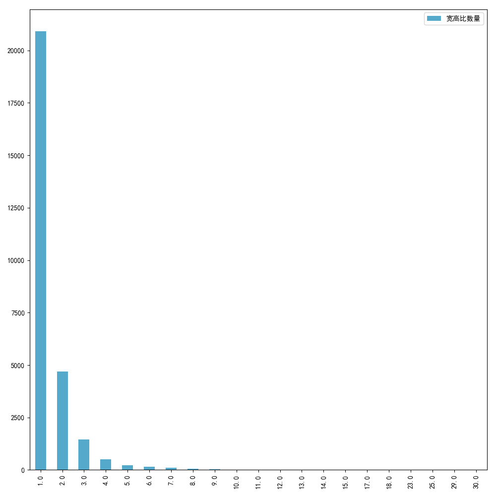
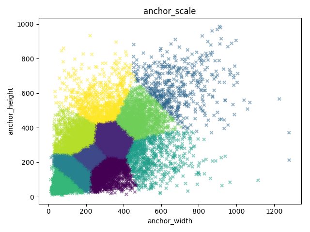
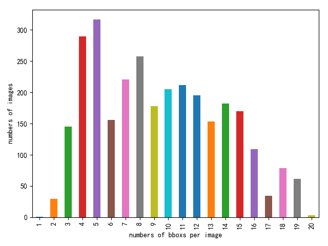

# Trashdetection

## Introduction

Trash detection task was held by biendata.The task is to detect trash in a given image and give the mAP of bbox.The dataset has 204 categories trash and resolution of images are mostly 1920x1080 and few 1440x1080.Every image has several trash.Trainset has 2999 pictures and valset has 1000 pictures and testset has the same numbers with the valset.We use the mmdetection tool box. 

mmdetection is an open source object detection toolbox based on PyTorch. It is
a part of the open-mmlab project developed by [Multimedia Laboratory, CUHK](http://mmlab.ie.cuhk.edu.hk/).

### Enviroments

- **version**
   
      pytorch 1.1.0
      GCC 4.9
      CUDA 9.0 CuDNN 7.5.1
      requirements.txt

### Datasets

#### processing

- **visualizing the anchor ratio**

The python file is analizytheanchorritio.py in the dataprocessing dir.

- **visualizing the bbox distribution**
 

- **visualizing the bbox distribution**

- **process the annotations**

The python file is the convertjson.py of the dataprocessing dir.This python file contains two parts:fix the annotaions file and add the single images to mutiple categories dataset to solve the maldistribution.

- **train from the scratch**

Use the single data to train the model rather than the ImageNet pre-trained ,but the effect is not well like we expected.Deleting the libpng read error image script is the testcontext.py in the dataprocessing dir. 

### Not tried on

#### Guided anchor 
#### BFP in the Libra RCNN

### Effectness

#### Our effectness is up to 0.902 in the validata dataset and 0.896 in the test dataset. 
